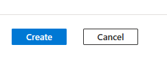
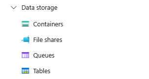
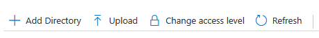
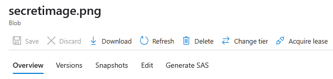
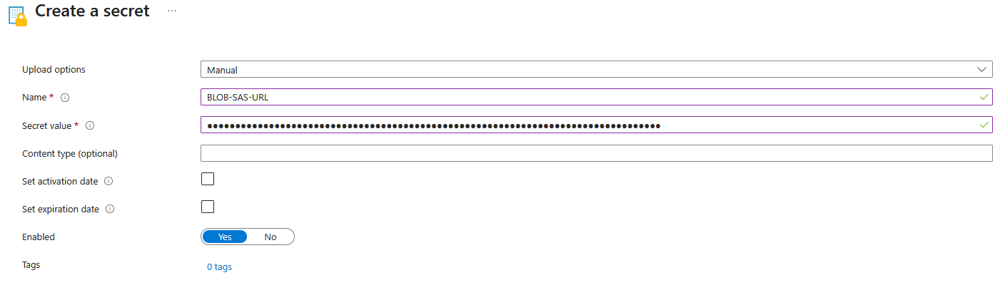

In modern cloud application development, securely handling sensitive configuration data like database connection strings, API keys, and access tokens is paramount, as embedding these **secrets** directly into code or repositories poses significant risks. This lab will focus on leveraging Azure Key Vault, a cloud service for securely storing secrets, to enhance the security of Azure Web Apps. We'll demonstrate how to store sensitive environment variables and highly sensitive Shared Access Signature (SAS) tokens within Key Vault, enabling your Azure Web Apps to dynamically and securely retrieve these values at runtime, eliminating hardcoding and establishing a best practice for secret management in your cloud applications.

This guide delineates the comprehensive process for deploying a Flask web application to Azure App Service. The methodology emphasizes the ` secure retrieval` of two distinct secrets—specifically, a textual *greeting message* and an *Azure Blob Storage Shared Access Signature (SAS) token*—from Azure Key Vault, facilitated by Azure Managed Identity. Subsequently, the application will demonstrate the display of an image directly sourced from Azure Blob Storage, utilizing the aforementioned SAS token. 

- [ ] Need to mention how we going to deploy the code.
- [ ] Need to define login steps.
- [ ] add the final keyvault ss
  
## Instructions


1. Create the **GREETING-MESSAGE** Secret in Key Vault:
   
   1.1. Navigate to its dedicated `overview` blade within the Azure portal.

   1.2 In the left-hand navigation pane, under the "Objects" section, click `Secrets.`
   
   

   1.3 Click the `Generate/Import` button located at the top of the interface.

   

   1.4 For `Upload options`, select `Manual`.

   1.5 For `Name`, input `GREETING-MESSAGE`.

   1.6 For `Value` enter the desired message, such as *Hello from Azure Key Vault! This message is super secret..*

   1.7 All other configuration parameters, including `Content Type` , "Activation date," "Expiration date," and "Enabled," should be retained at their default settings.

   

   1.8 Click `Create` at the bottom to finalize the secret's creation.

   


2. Create Blob Container and Upload Image to Storage Account:

   2.1. Navigate to the `Overview` blade of your pre-provisioned **Azure Storage Account**.

   2.2. In the left-hand **navigation pane**, under `Data storage` click `Containers`.

   

   2.3. Click the `Add Container` button.

   

   2.4. For `Name` specify *images*.

   2.5. For `Anonymous access level` select `Private (no anonymous access)` to enforce stringent security for the stored image.

   2.6. Click `Create`.

   

   2.7. Navigate into the newly created **images** container.

   2.8. Click the `Upload` button.

   

   2.9. Click `Browse for files` and select a small image file (e.g., a .png or .jpg format) from your local machine. It is advisable to rename the file to a concise identifier such as *secretimage.png* if not already appropriately named.

   2.10. Click `Upload`.

   


3. Generate Shared Access Signature (SAS) Token for the Blob:

   3.1. Within the images container in your Storage Account, locate and select the *secretimage.png* blob that was recently uploaded.

   3.2. From the blob's overview interface, click `Generate SAS` in the left-hand menu.

   

   3.3. For **Permissions**, ensure that only the **Read** permission is selected. This restrictive permission set is crucial for adherence to the principle of least privilege.

   3.4. For **Start and expiry date/time** define a practical expiration period (e.g., 24 hours from the current timestamp) suitable for the duration of the laboratory exercise.

   3.5. For **Allowed IP addresses** this field may be left unpopulated or configured for enhanced security by specifying permissible IP ranges; however, this is not strictly required for the present laboratory scenario.

   3.6. For **Allowed protocols**, select `HTTPS only`.

   3.7. Click `Generate SAS token and URL`.

   

   3.8. Crucially, copy only the **Blob SAS token** string and **Blob SAS URL** . This specific token will be securely stored within Azure Key Vault. It is imperative to avoid copying the "Blob SAS URL" or the "Blob URL."

   

   >   The values we need should be formatted like below:<p>
    **BLOB-SAS-URL**= ``` https://<storage-account-name>.blob.core.windows.net/<container-name>/<image-name>```</p>
    **BLOB-SAS-TOKEN** = sp=r&st=2025-06-14T20:57:30Z&se=2025-06-15T04:57:30Z&spr=https&sv=2024-11-04&sr=b&sig=###########################################


   

4. Create  **BLOB-SAS-TOKEN** and **BLOB-SAS-URL** Secret in Key Vault:

   4.1. Return to the Azure Key Vault's `Overview` blade within the Azure portal.

   4.2. In the left-hand navigation pane, under `Objects`, click `Secrets`.

   

   4.3. Click the `+ Generate/Import` button at the top of the interface.

   
   4.5. For **Upload options**, select **Manual**.

   4.6. For **Name**, input **BLOB-SAS-TOKEN**.


   4.7. For **Value**, paste the previously copied *Blob SAS token* string from Blob Storage.

   4.8. All other configuration settings should retain their default values.

   4.9. Click `Create` at the bottom to finalize the secret's creation.

   

   4.10 Same way lets create another secret for *SAS-BLOB_URL*, Click the `+ Generate/Import` button at the top of the interface.

   4.11. For **Upload options**, select **Manual**.

   4.12. For **Name**, input **BLOB-SAS-URL**.

   4.13. For **Value**, paste the previously copied *Blob SAS URL* string from Blob Storage.

   4.14. All other configuration settings should retain their default values.

   4.15. Click `Create` at the bottom to finalize the secret's creation.

   

   4.16 Once you complete up to this level, youre key vault should look like this.

   

Great job! You've successfully completed the lab requirements. You've skillfully **created Key Vault secrets**, **uploaded your image**, **generated a SAS token for secure access**, and **configured Key Vault with all the relevant secrets**. That's a crucial step in building secure cloud applications!


