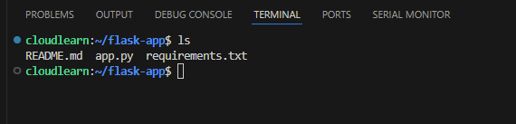

Zip-based application code deployment to an Azure Web App is a straightforward and efficient method for getting your application's files onto the Azure cloud. Essentially, you take all the necessary files for your web application (like Python code, HTML, CSS, JavaScript, and a `requirements.txt` file for dependencies) and package them into a single `.zip` archive.

Once zipped, you then use tools like the Azure CLI (Command Line Interface) to upload this zip file directly to your pre-configured Azure Web App. Azure's deployment engine (Kudu) automatically detects the zip file. It then extracts its contents, intelligently identifies the type of application (e.g., Python, Node.js, .NET), installs any required dependencies listed in your `requirements.txt` (or similar manifest files), and finally, starts your application.

This method is popular because it's simple, fast, and doesn't require setting up complex continuous integration/continuous deployment (CI/CD) pipelines or managing Git repositories for basic deployments. It's particularly useful for quick updates, testing, or when you need to deploy an application directly from your local development environment without external source control.

## Instructions


1.  Open Visual Studio Code and Integrated Terminal. You can do this in a few ways:

    ```
    * Go to **Terminal > New Terminal** from the top menu.
    * Use the keyboard shortcut:
        * Windows/Linux: `Ctrl + `` (backtick)
        * macOS: `Cmd + `` (backtick)
    ```
    

    A terminal window will appear at the bottom of your VS Code interface.

2. Initiate Azure Login. In the VS Code integrated terminal, type the following command and press Enter:

    ```bash
    az login
    ```
    
   

3. Complete Authentication in Your Browser. Upon executing `az login`, your default web browser will automatically open a new tab and redirect you to the Azure login page:

      * **Follow the prompts:** Enter your Azure account credentials (email, password, MFA if configured).
      * **Success Message:** Once authenticated, the browser tab will display a message indicating that you have successfully logged in and can close the window.

    Back in your VS Code terminal, you will see a JSON output showing your subscription details, including your tenant ID, user information, and the default subscription you are logged into.


        ```json
        {
        "cloudName": "AzureCloud",
        "homeTenantId": "xxxxxxxx-xxxx-xxxx-xxxx-xxxxxxxxxxxx",
        "id": "yyyyyyyy-yyyy-yyyy-yyyy-yyyyyyyyyyyy",
        "isDefault": true,
        "managedByTenants": [],
        "name": "My Azure Subscription",
        "state": "Enabled",
        "tenantId": "xxxxxxxx-xxxx-xxxx-xxxx-xxxxxxxxxxxx",
        "user": {
            "name": "your_email@example.com",
            "type": "User"
        }
        }
        ```

4. Download the flask application codes using following command. we have develop sample application and all relevant source code files can be access using following Git Hub repository:

    ```bash
    git clone https://github.com/Dhananjaya-Kurukulasooriya/flask-app.git
    cd your-repo-name # Change into the repository directory
    ```
    
      * **Verification (within the terminal):**
        ```bash
        ls -l
        ```
        You should see your `app.py` and `requirements.txt` listed.
    


5. Run following command to Create a Zip Archive of Your Application:

    ``` bash
    zip -r myflaskapp.zip . -x ".*" -x "*__pycache__*" -x "*.venv*"
    ```
    A file named `myflaskapp.zip` will be created in your current directory. You can verify this in the lab's file explorer or by running `ls -l`.
      

6. Run the following command to Enable Build Automation for Python Apps: (Important!)

    ```bash
    az webapp config appsettings set --name YOUR_WEB_APP_NAME \
    --resource-group YOUR_RESOURCE_GROUP_NAME \
    --settings SCM_DO_BUILD_DURING_DEPLOYMENT=true
    ```
    * **Replace:** `YOUR_WEB_APP_NAME` and `YOUR_RESOURCE_GROUP_NAME` with your actual Azure Web App's name and its resource group.
  
   This application setting (`SCM_DO_BUILD_DURING_DEPLOYMENT`) ensures Azure automatically runs the build process (including `requirements.txt` installation) during deployment.


7. Run the following command to Upload and Deploy the Zip Package to Azure Web app:

   ```bash
    az webapp deploy --resource-group YOUR_RESOURCE_GROUP_NAME \
    --name YOUR_WEB_APP_NAME \
    --src-path myflaskapp.zip \
    --type zip
    ```
* **Expected Output:** Messages in your lab's terminal indicating upload progress and successful deployment. This might take a few minutes.


8. Run the following command to Retrieve the URL of your deployed web app from the terminal and open it in your web browser:
   
* **Command:**
    ```bash
    az webapp show --name YOUR_WEB_APP_NAME --resource-group YOUR_RESOURCE_GROUP_NAME --query "defaultHostName" -o tsv
    ```
* **Expected Output:** The URL of your Azure Web App (e.g., `myflaskapp-demo-123.azurewebsites.net`). Copy this URL from the lab's terminal and paste it into a new tab in your *local* web browser. Your Flask application should now be accessible. Keep this URL for testing once all configured.

9. Run the following command to  enable a system-assigned managed identity for your Azure Web App:

    ```bash
    az webapp identity assign \
    --resource-group YOUR_RESOURCE_GROUP_NAME \
    --name YOUR_WEB_APP_NAME
    ```

   This operation provisions an automatically managed identity for your App Service within Azure Active Directory, thereby enabling secure authentication with other Azure services, such as Key Vault, without the necessity of explicit credential management. The "Object ID" displayed may be noted for record-keeping, though it is not directly employed in subsequent procedural steps.
