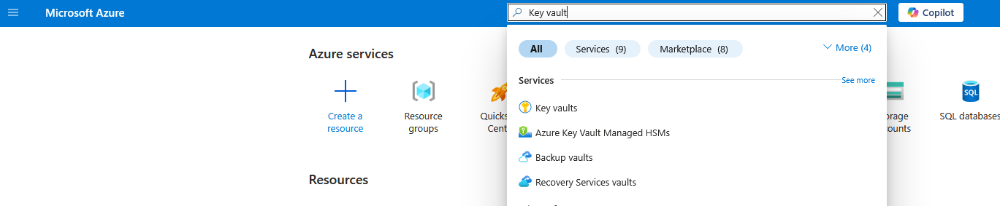
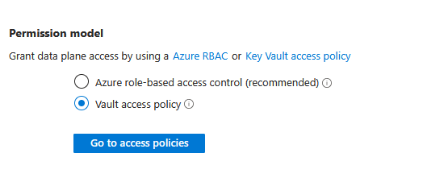
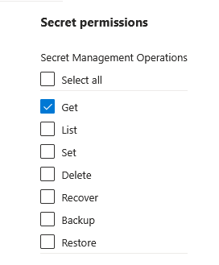
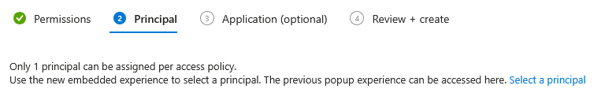
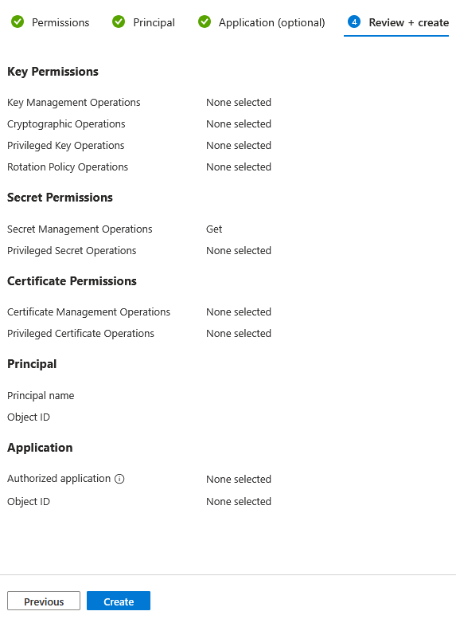

In this crucial step, we establish a secure connection between your Azure Web App and Azure Key Vault. We'll grant the Web App's System-Assigned Managed Identity (which we enabled previously) the necessary permissions to retrieve secrets from your Key Vault. This allows your Web App to fetch sensitive values (like database connection strings, API keys, or in this lab's case, the greeting message and blob storage details) from Key Vault at runtime. Finally, we'll configure your Web App's application settings to reference these Key Vault secrets, ensuring they are securely injected as environment variables for your application to consume, without ever being directly exposed in your app's configuration.
    
## Instructions

Grant Key Vault Secret Access to App Service:
1. Search for `key vault` in Azure Portal and select the `key vault name`:
    
     


2. In the left-hand navigation pane, click `Access configuration` and select the `Vault access Policy` radio button under Permission Model:
   
    
    
3. Click on `Apply` button at the bottom of the page and wait until configurations are getting applied:
   
   

4. In the left-hand navigation pane, click `Access policies` and click the `+ Create` to create new Access Permisions:
   
   


    
5. Select  Only `Get` checkbox Under **Secret permissions** and select `Next` button at the bottom of the page:
   
   

6. Since we need to give this permission to "Principal," click the `+ Select principal` button:
   

7. In the search field, enter the name of your App Service (e.g., securegreetingapp-yourname) and select its corresponding Managed Identity from the presented results and Click the `Select` button at the bottom:

8.  Proceed to "Review + create," and then click "Create" to establish the access policy and Click `Create`:
        
    
         
---
Link Key Vault Secrets to App Service Settings: 

9. Lets create **App settings** for the web app to fetch secrets from the key vault: Run following command to set the web app, **App Settings**:
    
    ```bash 
    az webapp config appsettings set \
    --resource-group YOUR_RESOURCE_GROUP_NAME \
    --name YOUR_WEB_APP_NAME \
    --settings \
    GREETING_MESSAGE="@Microsoft.KeyVault(SecretUri=https://YOUR_KEY_VAULT_NAME.vault.azure.net/secrets/GreetingMessage/)" \
    BLOB_STORAGE_URL="@Microsoft.KeyVault(SecretUri=https://YOUR_KEY_VAULT_NAME.vault.azure.net/secrets/BlobStorageUrl/)" \
    BLOB_SAS_TOKEN="@Microsoft.KeyVault(SecretUri=https://YOUR_KEY_VAULT_NAME.vault.azure.net/secrets/BlobSasToken/)"

    ```   

     Replace the placeholders:

    * **YOUR_RESOURCE_GROUP_NAME**: The name of the Azure resource group containing your Web App.
    * **YOUR_WEB_APP_NAME**: The name of your Azure Web App.
    * **YOUR_KEY_VAULT_NAME**: The name of your Azure Key Vault.

10. To Test and Verify Deployment we need to restart the web application:
    Run the following command to restart the application:
    ```bash
    az webapp restart \
    --resource-group YOUR_RESOURCE_GROUP_NAME \
    --name YOUR_WEB_APP_NAME
    ```
       
11. Run the following command to Retrieve the URL of your deployed web app from the terminal and open it in your web browser.
   
* **Command:**
    ```bash
    az webapp show --name YOUR_WEB_APP_NAME --resource-group YOUR_RESOURCE_GROUP_NAME --query "defaultHostName" -o tsv
    ```
    * **Expected Output:** The URL of your Azure Web App (e.g., `myflaskapp-demo-123.azurewebsites.net`). Copy this URL from the lab's terminal and paste it into a new tab in your *local* web browser. Your Flask application should now be accessible.
    
This concluding phase involves the rigorous testing of the deployed application to confirm its intended functionality, including the secure retrieval of secrets and the successful display of the image.


## Conclusion: Unlocking Secure and Scalable Cloud Deployments

This lab has provided a comprehensive, hands-on experience in deploying a Flask application to Azure Web Apps while integrating critical security best practices. By following the steps, you've not only learned how to get your Python code running in the cloud but, more importantly, how to secure your application's sensitive configurations.

**Key Benefits Demonstrated by This Lab:**

* **Enhanced Security:** The primary triumph of this lab is the secure management of application secrets. By utilizing Azure Key Vault, you've learned to externalize sensitive information like API keys and storage credentials, preventing them from being hardcoded in your application's source code or configuration files. This significantly reduces the risk of accidental exposure in repositories or insecure environments.
* **Leveraging Managed Identities:** You've seen firsthand how Azure's System-Assigned Managed Identities simplify authentication to other Azure services. By granting your Web App's identity specific permissions to Key Vault, you eliminate the need for manually managing connection strings, service principal credentials, or rotating secrets within your application code, thereby boosting security and operational efficiency.
* **Robust Configuration Management:** The lab showcased how Azure App Service's application settings, when combined with Key Vault references, provide a powerful and flexible way to manage your application's environment variables. Changes to secrets in Key Vault can be reflected in your running application with a simple restart, without requiring code deployments.
* **Adherence to Cloud Best Practices:** This methodology aligns with industry best practices for cloud-native application development, emphasizing the principle of "never hardcode secrets" and promoting centralized, secure secret storage.
* **Streamlined Deployment & Operations:** The use of Azure CLI for deployment and configuration demonstrated how command-line tools enable automation and repeatable processes, which are crucial for efficient development and DevOps workflows.

In essence, this lab empowers you with the knowledge to build and deploy web applications on Azure that are not only functional but also inherently more secure, maintainable, and scalable, laying a strong foundation for your future cloud projects.